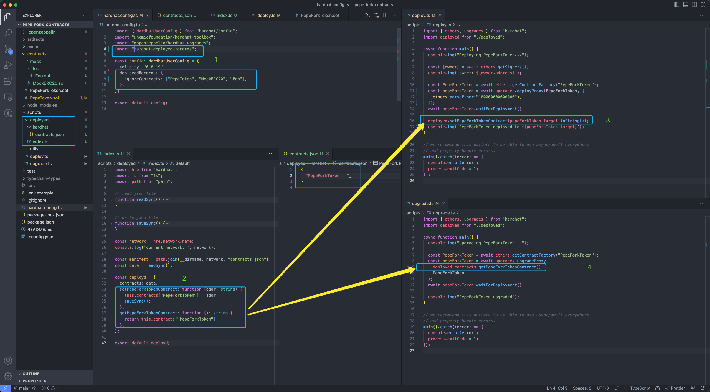

## Hardhat Deployed Records

Recording deployed contracts address.

#### 1. Install

```
$ npm install --save-dev hardhat-deployed-records
# or
$ yarn add --dev hardhat-deployed-records
```

#### 2. Included Commands

- `npx hardhat deployed-init [--netwrok <network>]`: Initializes the deployed folder, `--netwrok` parameter is optional, default value is `hardhat` from Hardhat framework.
- `npx hardhat deployed-add [--netwrok <network>]`: Generating new boring code for deploying to new chain specified by `--netwrok` parameter.
- `npx hardhat deployed-migrate`: Migrate the deployed folder
- `npx hardhat deployed-list [--netwrok <network>]`: Listing contracts deployed address of the chain specified by `--netwrok` parameter.

Commonly, you need execute `npx hardhat deployed-init [--netwrok <network>]` task first, and then:
- when you want to deploy contracts to a new network, you need to execute `npx hardhat deployed-add --netwrok <network>` task
- when you add new contracts or delete contracts you need to execute `npx hardhat deployed-migrate` task to keep deployed folder is the latest.

#### 3. Usage

Load plugin in Hardhat config:

```
require('hardhat-deployed-records');
# or
import 'hardhat-deployed-records';
```

Add configuration under `deployedRecords` key:

| option            | description                                                       | optional | default            |
|-------------------|-------------------------------------------------------------------|----------|--------------------|
| `deployedDir`     | path to generated `deployed` directory (relative to Hardhat root) | true     | `scripts/deployed` |
| `ignoreContracts` | which contracts wants to igonre                                   | true     | `[]`               |

example:

```
deployedRecords: {
    deployedDir: "scripts/deployed",
    ignoreContracts: ["MockERC20", "Foo"],
}
```

#### 4. The `scripts/deployed` directory's structure and how to use generated functions

when you execute `npx hardhat deployed-init [--netwrok <network>]` task, it will generate default `scripts/deployed` directory(if you not set a different `deployedDir` value in `hardhat.config.ts` config file).

following is a `scripts/deployed` directory example:



so, in your deploy scripts, you can use `getXxxContract()` function to get contract's address; and use `setXxxContract(addr)` function to set contract's address.

#### 5. Version History

- v0.3.6 (2023/12/08)
  - fix typo `deployd` to `deployed`

- v0.3.3 (2023/10/13)
  - beautify `deployed-list` command's output

- v0.3.2 (2023/10/13)
  - add `deployed-list` command

- v0.3.1 (2023/09/15)
  - auto skip solidity `library` contract

- v0.3.0 (2023/08/18)
    - auto skip `interface` type contract
    - support multiple contracts in one solidity file
